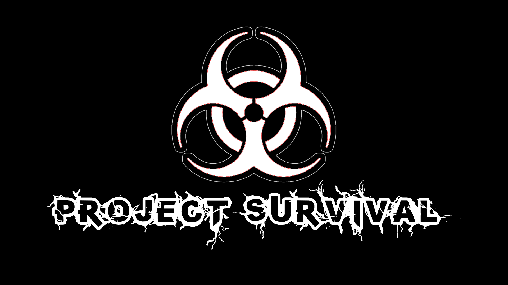

# Project Survival

## Overview
**Project Survival** is a first-person stealth horror game
set in a hostile, post-apocalyptic world.
(Developed as our Universal Design Project in 3rd year,
using a 3D game engine built on MonoGame)

## Features
- **Horror Experience**: if you want to survive the horrors
 of this world, your only chance is to hide, sneak... or run.
- **Emphasis on Audio**: Chilling and atmospheric sounds to provide a binaural horror experience.
- **Hide and Sneak**: Stealth-based gameplay with puzzle elements.

## Default Controls

### Keyboard and Mouse
- Movement: W,A,S,D or Arrow Keys
- Look Around: Mouse
- Toggle Crouch: Left Ctrl
- Run: Hold Left Shift
- Interact with Items: E
- Place and Use Radio: R

### Xbox Controller
- Movement: Left Joystick
- Look Around: Right Joystick
- Toggle Crouch: X
- Run: Press Left Joystick
- Interact with Items: Y
- Place and Use Radio: Right Shoulder Button